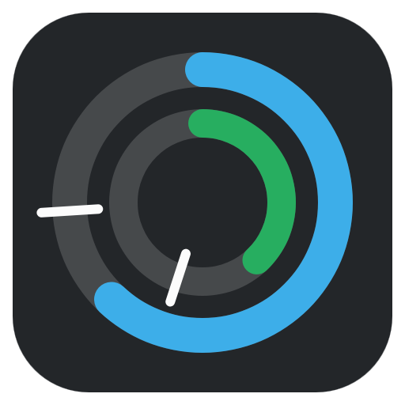
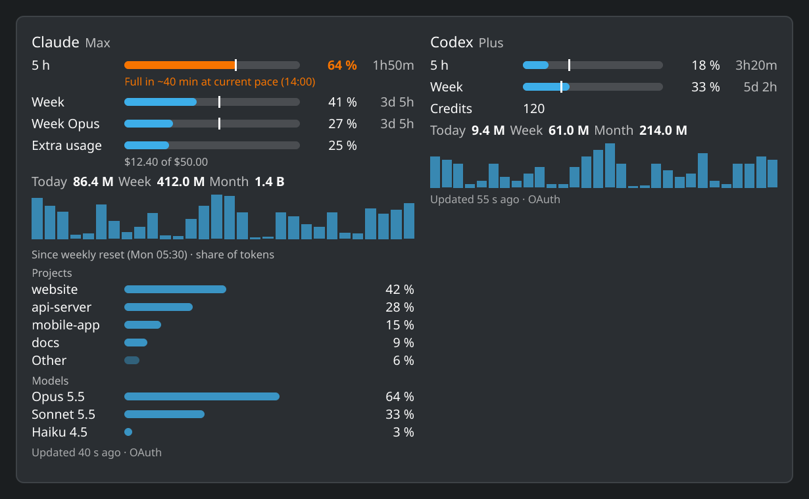
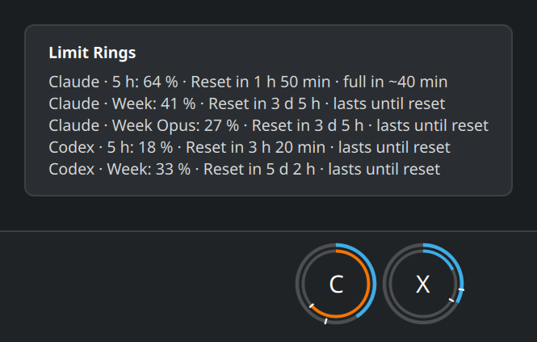
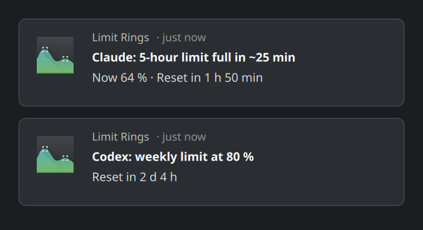
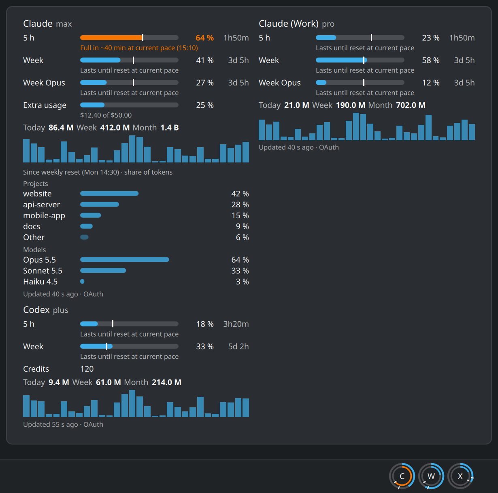

<p align="center">
  
</p>

<h1 align="center">Limit Rings</h1>

<p align="center">
  KDE Plasma 6 widget showing usage limits and token statistics for <b>Claude Code</b> and <b>Codex</b>.
</p>

<p align="center">
  <a href="https://github.com/Flexomatic81/limit-rings/actions/workflows/test.yml"></a>
  <a href="https://github.com/Flexomatic81/limit-rings/releases/latest"></a>
  <a href="https://store.kde.org/p/2377644/"></a>
  
  
  <a href="LICENSE"></a>
</p>

<p align="center">
  
  <br>
  <sub>All screenshots show sample data.</sub>
</p>

> [!IMPORTANT]
> **Your logins at a glance:** Limit Rings asks undocumented usage endpoints of Anthropic and OpenAI,
> using the logins Claude Code and Codex keep on your machine. Tokens are only read – never stored,
> refreshed or logged – and only sent to `api.anthropic.com` or `chatgpt.com`, at most every 5 minutes.
> Details and the providers' terms: [Important: unofficial APIs and your logins](#important-unofficial-apis-and-your-logins).

## Quick start

Requires KDE Plasma 6 and Python ≥ 3.10. Right-click the panel → "Add Widgets…" → "Get New Widgets…" →
"Download New Plasma Widgets", search for **Limit Rings** and drag it onto a panel or the desktop – or get it
from the [KDE Store](https://store.kde.org/p/2377644/). Installing from GitHub:
see [Installation](#installation).

## Features

### In the panel



- One double ring per provider — the outer ring shows the weekly limit, the inner one the 5-hour limit;
  the tooltip lists all limits with a countdown.
- A mark on each ring and bar shows how much of the window has passed, and a ring turns to the warning
  colour as soon as it would run out before the reset at the current pace.
- Works on horizontal and vertical panels.

### On the desktop or in the popup

- Limits with a reset countdown, tokens for today/week/month, and a history chart over 30 days, 3 months
  (per week) or 12 months (per month).
- Claude extra usage (amount spent and monthly limit) and Codex credits, when your account has them.
- Forecast of when a limit will be reached at the current pace (5 h: last 30 min, week: last 24 h).
- Breakdown of Claude tokens since the weekly reset by project (Git repository) and model — only
  for the transcripts on the current machine, as a share of tokens (not of the limit).
- Hint in the card and tooltip when the Claude login has expired.
- A note in the card for three days when a provider changes its limits: a window is new, comes back,
  is no longer reported, changes length or resets early.
- "Refresh now" in the context menu: reads the logs right away; the limits follow the 5-minute
  interval, and the card says when they are asked for next.

### Notifications



- Desktop notification when a limit reaches 80 % or 95 % (adjustable), plus an early warning when the
  forecast says the 5-hour limit will be full within 30 minutes or the weekly limit within 24 hours
  (each at most once per window); optionally a notice when a limit that had warned has reset.

### More

- [Several accounts](#several-accounts) per provider (own `CLAUDE_CONFIG_DIR` / `CODEX_HOME`), each with
  its own ring and card.
- Works without your logins if you prefer: [limits from local copies only](#without-login).
- Shows what is left of each limit instead of what is used, if you prefer ("Percentages" in the settings).
- The current limits as JSON for scripts and bars such as Waybar ([status output](#status-for-scripts-and-bars)).
- The daily token counts of up to 400 days as CSV or JSON ([export](#exporting-the-token-history)).
- Widget and notifications follow the system language (English, German).

## Important: unofficial APIs and your logins

Limit Rings fetches usage limits from **undocumented endpoints** of Anthropic
(`api.anthropic.com/api/oauth/usage`) and OpenAI (`chatgpt.com/backend-api/wham/usage`) – the
numbers Claude Code and Codex show you themselves. To ask for them, it uses the logins that Claude Code
and Codex store on your machine.

### What is read and where it goes

| | Claude Code | Codex |
|---|---|---|
| File | `~/.claude/.credentials.json` (and `<dir>/.credentials.json` of each additional Claude account); on macOS without that file the keychain entry `Claude Code-credentials` | `~/.codex/auth.json` (and `<dir>/auth.json` of each additional Codex account) |
| Read from it | access token, its expiry, plan name | access token, account ID |
| Sent to | `api.anthropic.com` only | `chatgpt.com` only |
| Asked for | the usage numbers of your plan | the usage numbers of your plan |
| How often | at most every 5 minutes | at most every 5 minutes |

If a provider answers "too many requests", Limit Rings waits as long as it asks (at most 6 hours)
before the next request.

### What Limit Rings never does

- Run models or send prompts with your login – it only asks for the usage numbers.
- Refresh, store, copy or log a token. An expired token simply goes unused until Claude Code or Codex
  renews it.
- Write to the login files of Claude Code or Codex, or to their keychain entry.
- Follow redirects – the token could otherwise end up at another host.
- Touch a directory you have not listed under "Additional accounts", or an account you have unticked there.
- Touch a provider you have switched off: with Claude or Codex unticked under "Show:" in the
  settings, its login and logs are not read and its endpoint is not asked.
- Open a login file with "Live limits via login" switched off for its provider.

### Without login

Under "Live limits via login" in the settings you can switch the login off for Claude, Codex or both.
Limit Rings then never opens that provider's login file and never asks its usage endpoint; the limits
come only from local copies:

- **Claude:** from the status line copy (`statusline-snippet.sh`), i.e. only while Claude Code runs in a
  terminal with that status line – `install.sh` sets it up, Store installs add the snippet by hand. Only
  the 5-hour and the weekly limit: no limits per model, no extra usage, no plan name. Additional Claude
  accounts have no status line copy and show no limits.
- **Codex:** from the session logs, i.e. only after you used Codex in a terminal – Codex running only
  as the Claude Code plugin writes none. No credits.

Token statistics, history and breakdown come from the local logs anyway and stay as they are. The
setting applies to the widget you set it in (and to the provider's additional accounts): with a second
Limit Rings widget, switch it off there too.

### The providers' terms

Anthropic's documentation says that the subscription login is
["intended exclusively for purchasers of Claude Free, Pro, Max, Team, and Enterprise subscription
plans and is designed to support ordinary use of Claude Code and other native Anthropic
applications"](https://code.claude.com/docs/en/legal-and-compliance#authentication-and-credential-use).
Limit Rings is not such an application. It runs no models and keeps no tokens – it reads the usage
numbers that Claude Code's `/usage` shows, for your own account, on your own machine. Anthropic has not
said whether such read-only use is allowed, and it reserves the right to enforce its rules without
prior notice. OpenAI has published no rules for its usage endpoint.

So please check the terms of service of Anthropic and OpenAI yourself and decide whether you are
comfortable with this. If not, switch the provider off in the widget's settings. Should a provider
block these requests, Limit Rings falls back to local data (status line or session logs).

This project is not affiliated with Anthropic or OpenAI; "Claude" and "Codex" are trademarks of their
respective companies.

## How it works

The widget brings its own collector (`collector/`, Python standard library only) and runs it every 60 s.
The collector incrementally reads `~/.claude/projects/**/*.jsonl` and `~/.codex/sessions/**/*.jsonl`,
writes `~/.cache/limit-rings/stats.json` and hands the result and any due notifications back to the
widget; its log is `~/.cache/limit-rings/collector.log`.

Claude limits come from the (undocumented) OAuth usage endpoint; the token from
`~/.claude/.credentials.json` is only read and only sent to `api.anthropic.com`. On macOS, where Claude
Code keeps its login in the keychain, the collector reads the entry `Claude Code-credentials` with
Apple's `security` tool instead – only while that file is missing, and at most every 5 minutes, since
macOS asks once for permission. Between reads it keeps the plan name and expiry, never the token.
Additional Claude accounts are read from their `.credentials.json` only. If the endpoint
fails, a capture of the Claude Code status line serves as a fallback.

Codex limits likewise come directly from the Codex service (ChatGPT login from `~/.codex/auth.json`,
token only read and only sent to `chatgpt.com`); the fallback is the session logs. This is
necessary because Codex running as a Claude Code plugin does not write session logs. For the same
reason, the Codex token statistics only count Codex sessions run in a terminal.

## Installation

Requirements: KDE Plasma 6 and Python ≥ 3.10 (`python3`, no extra packages). `jq` only for the
optional status line fallback.

### From the KDE Store (recommended)

Right-click the panel or desktop → "Add Widgets…" → "Get New Widgets…" → "Download New Plasma Widgets",
search for **Limit Rings**, install it, then drag it onto a panel and/or the desktop. The entry on the
store: <https://store.kde.org/p/2377644/>.

### From GitHub

```bash
git clone https://github.com/Flexomatic81/limit-rings.git
cd limit-rings
./install.sh                     # asks before modifying the status line
./install.sh --statusline        # inserts the status line hook without asking
./install.sh --migrate-widgets   # switches placed "Agent Stats" widgets without asking
```

`install.sh` checks the requirements first and names the install command for your distribution if
something is missing. Use one way or the other: both install the same widget, the last one wins.

### macOS (Übersicht)

A second widget runs on macOS in [Übersicht](https://tracesof.net/uebersicht/). It uses the same collector
and the same display logic as the Plasma widget and shows one card per provider: rings and bars with the
pace mark and the reset countdown, tokens for today/week/month and the history over 30 days. It has no
notifications, no additional accounts, no breakdown by project and model, no extra usage and no 3- or
12-month ranges.

**Install with one command** in Terminal:

```bash
curl -fsSL https://github.com/Flexomatic81/limit-rings/releases/latest/download/install-macos.sh | sh
```

It works from the first release that ships the installer. Run the same command again to update. It needs
no admin rights and writes only inside your home folder. It:

- installs Übersicht into `~/Applications` if you have none – downloaded from tracesof.net and used only
  after its signature, notarization and developer ID check out. An Übersicht you already have is kept
  (it updates itself);
- downloads the widget from the release, verifies its checksum and puts it into Übersicht's widgets
  folder. A failed update keeps the old widget, and your `settings.json` stays;
- removes Übersicht's welcome widget if it is still the unchanged original;
- starts Übersicht at login (macOS shows "Background item added" once) and starts it now. Add
  `--no-login-item` to skip the login item: `… | sh -s -- --no-login-item`;
- checks for Python and warns if it is missing.

`--version vX.Y.Z` installs a specific release. To remove everything the installer set up (the widget, the
login item and the cache in `~/.cache/limit-rings`; Übersicht stays):

```bash
curl -fsSL https://github.com/Flexomatic81/limit-rings/releases/latest/download/install-macos.sh | sh -s -- --uninstall
```

Requirements: Python ≥ 3.10 from [python.org](https://www.python.org/downloads/macos/) (Homebrew works
too). Apple's own `python3` is 3.9 and too old; if no suitable Python is found, the card says so.

#### Without the installer

Install [Übersicht](https://tracesof.net/uebersicht/) yourself, then:

1. Download `limit-rings-macos-<version>.zip` from the
   [latest release](https://github.com/Flexomatic81/limit-rings/releases/latest) and unzip it.
2. Move `limit-rings.widget` into `~/Library/Application Support/Übersicht/widgets/`. Keep the folder name:
   the widget does not run under another one (the card says so). To update, delete the old folder first,
   then move the new one in – unzipping next to it would create `limit-rings.widget 2`.

#### Settings and login

Settings (providers, login, remaining instead of used, thresholds, position) are in
`limit-rings.widget/settings.json`; Übersicht reloads the widget when you save it. The installer keeps
this file when it updates the widget.

Claude Code keeps its login in the keychain on macOS. macOS may ask once whether `security` may
read the entry `Claude Code-credentials` – choose "Always Allow" (see [What is read](#what-is-read-and-where-it-goes)).
The prompt appears in your desktop session only, not over SSH. Everything said about your logins above
applies unchanged: it is the same collector, tokens are only read and only sent to the provider, at most
every 5 minutes.

### Updating

The widget tells you when a new version is out (it asks GitHub once a day; switch it off in its
settings). Store installs update via "Get New Widgets…" or Discover; GitHub installs with
`git pull && ./install.sh`. Afterwards restart Plasma (`systemctl --user restart plasma-plasmashell`)
or log out and back in.

### After installing

Place the widget as described above and check:

```bash
jq '.providers | map_values({limits_source, errors})' ~/.cache/limit-rings/stats.json
```

- Token statistics only count the logs of **this** machine; the limits belong to the account and
  are the same on every machine. To use Limit Rings on several machines, simply install it on each.
- If `~/.claude/.credentials.json` holds a valid token, the Claude limits come via OAuth
  (`limits_source: "oauth"`). Claude Code only refreshes the token while it runs in a terminal (it
  is valid for about 8 h); the Claude desktop app does not write a token to this file. Without a
  valid token, the status line provides the limits as long as Claude Code is running in a terminal.
- The status line fallback requires a custom Claude Code status line script at
  `~/.claude/statusline-command.sh` containing a line `input=$(cat)`; `install.sh` inserts the
  required line (`statusline-snippet.sh`) there. Without such a script, this step is skipped.
  Store installs do not touch the status line; add the snippet by hand if you want the fallback.

### Several accounts

If you use more than one login per provider (for example a work and a private Claude account, each with
its own `CLAUDE_CONFIG_DIR`, or a second `CODEX_HOME`), add them in the widget's settings under
"Additional accounts" (up to 8): choose Claude or Codex, the account's directory (e.g. `~/.claude-work`),
a name and a short label for the ring, and leave "Show" ticked. Each shown account gets its own ring and
card with its own limits, forecast, token statistics, pause after "too many requests" and notifications
("Claude (Work): 5-hour limit at 82 %").

<p align="center">
  
</p>

- Only the directories you list are read: `<dir>/.credentials.json` and `<dir>/projects` for Claude,
  `<dir>/auth.json` and `<dir>/sessions` for Codex. An account you untick is neither read nor asked.
  The tokens go only to `api.anthropic.com` / `chatgpt.com`, at most every 5 minutes per account.
- A directory must differ from the main account's (`~/.claude`, `~/.codex`) and from other accounts
  of the same provider.
- Additional accounts have no status line fallback: without a valid login, a Claude account shows no
  limits.
- The state of an account lives in `~/.cache/limit-rings/accounts/`; the files of accounts that are not
  shown are removed after 30 days.

### Upgrading from Agent Stats

Versions up to 0.1 were called *Agent Stats*. `./install.sh` takes an existing installation over:
it stops and removes the old timer and collector, moves `~/.cache/agent-stats` to
`~/.cache/limit-rings` (history and notification state are kept) and points the status line hook
at the new path (backup: `statusline-command.sh.bak-limit-rings`). Widgets that are already placed
are switched to the new plugin ID after confirmation, keeping position and settings – this
restarts the Plasma shell. `./install.sh --migrate-widgets` does it without asking.
From 0.3 on, `install.sh` also removes the systemd timer of earlier versions; history and
notification state are kept.

## Uninstalling

```bash
./uninstall.sh          # asks whether to delete ~/.cache/limit-rings
./uninstall.sh --purge
```

Store installs: uninstall the widget via "Get New Widgets…" (removing it from the panel does not uninstall
the package), then `rm -r ~/.cache/limit-rings`.

## Troubleshooting

```bash
tail -n 50 ~/.cache/limit-rings/collector.log
jq . ~/.cache/limit-rings/stats.json
# one pass by hand; LIMIT_RINGS_NOTIFY=0 leaves due notices for the widget to show
LIMIT_RINGS_NOTIFY=0 python3 ~/.local/share/plasma/plasmoids/io.github.flexomatic81.limitrings/contents/collector/run.py
```

## Status for scripts and bars

The limits the widget collected last can be read by scripts, shell prompts or bars such as Waybar:

```bash
python3 ~/.local/share/plasma/plasmoids/io.github.flexomatic81.limitrings/contents/collector/run.py --status
```

This only reads `~/.cache/limit-rings/stats.json`, which the widget's collector writes every 60 s: it sends no
request, reads no log or login and writes nothing. The widget therefore has to be running; `stale` says when the
last pass is more than 5 minutes old.

```json
{
  "status_version": 1,
  "generated_at": "2026-10-08T13:20:00+02:00",
  "stale": false,
  "providers": [
    {"id": "claude", "provider": "claude", "name": "Claude", "account": null, "plan": "max", "login": true,
     "limits_source": "oauth", "limits_updated_at": "2026-10-08T13:19:30+02:00",
     "limits": [{"id": "five_hour", "window_minutes": 300, "model": null, "used_percent": 64.0,
                 "remaining_percent": 36.0, "resets_at": "2026-10-08T15:10:00+02:00", "reset": false,
                 "forecast": {"status": "full", "eta": "2026-10-08T14:00:00+02:00"}}]}
  ]
}
```

- One entry per provider and per additional account (`"account": {"name": …, "dir": …}`).
- `forecast` is `{"status": "full", "eta": …}`, `{"status": "enough"}` or `null`; a window whose reset has
  passed has `"reset": true` and counts as 0 % used.
- The format is versioned: within `status_version` 1, fields are only added, never renamed or removed.

With `--status --waybar` the output is a Waybar custom module (`text` like `C 64% · X 33%`, a tooltip with
every limit, `percentage`, and `class` `normal`/`warning`/`critical` – from 70 % and 90 % used or a forecast
that runs out before the reset – plus `stale`):

```json
"custom/limit-rings": {
    "exec": "python3 ~/.local/share/plasma/plasmoids/io.github.flexomatic81.limitrings/contents/collector/run.py --status --waybar",
    "return-type": "json",
    "interval": 60
}
```

## Exporting the token history

The collector keeps the daily token counts for 400 days. To get them as CSV (or as JSON with `--json`):

```bash
python3 ~/.local/share/plasma/plasmoids/io.github.flexomatic81.limitrings/contents/collector/run.py --export > tokens.csv
```

```csv
date,provider,account,input,output,cache_read,cache_write,total
2026-10-07,claude,,1520,48210,8123400,412300,8585430
2026-10-07,claude,Work,800,12000,950000,64000,1026800
2026-10-07,codex,,210000,18000,1200000,0,1428000
```

- One row per day with tokens, provider and account (empty for the main login), oldest first. Additional
  accounts are included while the widget shows them.
- Like `--status`, this only reads `~/.cache/limit-rings`: no request, no log or login read, nothing written.
- `--json` gives `{"export_version": 1, "days": [...]}` with the same fields (`account` is `null` for the
  main login); within version 1, fields are only added, never renamed or removed.

## Privacy & network

Limit Rings contacts `api.anthropic.com` and `chatgpt.com` (limits, at most every 5 minutes and paused
after "too many requests", with the logins described in
[Important: unofficial APIs and your logins](#important-unofficial-apis-and-your-logins); not for a
provider or account you have switched off, or with "Live limits via login" off) and `api.github.com` (new version check, once a day, no personal data;
can be switched off). Nothing else leaves your machine.

## Development

Contributions are welcome – see [CONTRIBUTING.md](CONTRIBUTING.md). Pull requests go against `dev`.

```bash
cd collector && uv run --no-project --with pytest pytest -q
/usr/lib/qt6/bin/qmltestrunner -input plasmoid/tests
plasmawindowed io.github.flexomatic81.limitrings
python3 tools/build_plasmoid.py --source store   # dist/limit-rings-<version>.plasmoid
```

Releasing: raise `Version` in `metadata.json`, add a `CHANGELOG.md` section, push a tag `vX.Y.Z`.
The release workflow tests, builds and drafts a GitHub release; upload its `.plasmoid` to the KDE
Store, then publish the draft.

## Translations

Texts live in `po/plasmoid/<lang>.po` (widget) and `po/collector/<lang>.po` (notifications).
To add a language, create empty catalogs from the current texts – `msginit` also sets the
plural rules of the language, which differ from German for e.g. Polish or Russian:

```bash
tmp=$(mktemp -d) && po/update.sh --extract "$tmp"
msginit --no-translator -l <lang> -i "$tmp/plasmoid.pot" -o po/plasmoid/<lang>.po
msginit --no-translator -l <lang> -i "$tmp/collector.pot" -o po/collector/<lang>.po
```

Then translate the `msgstr` entries and run `./install.sh`. gettext is only needed to edit catalogs,
not to install. After changing texts in the code,
run `po/update.sh` to merge them into all catalogs; `collector/tests/test_translations.py` fails
while a catalog is incomplete.

## License

MIT, see [LICENSE](LICENSE).
